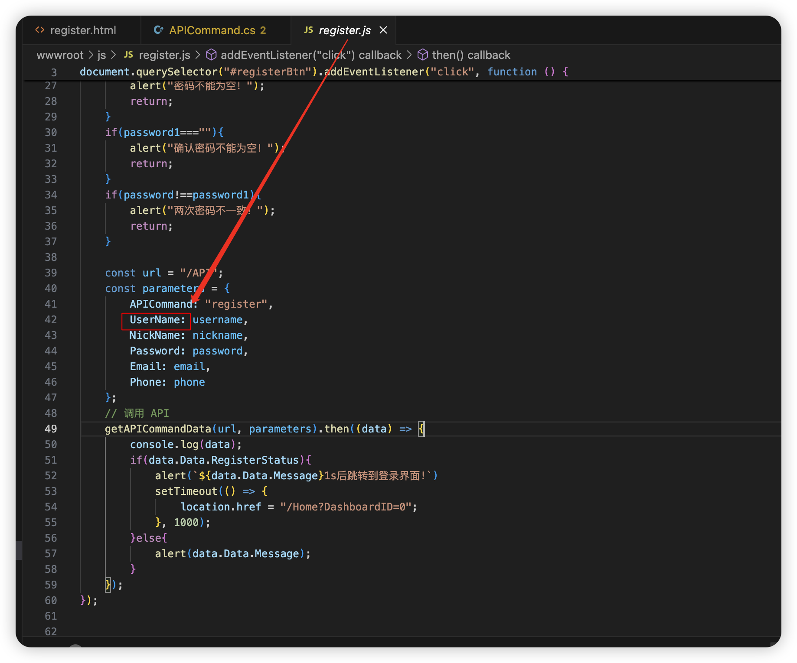

# TaskSystem

#### 介绍
计算机实用技术课程关于简单web应用的实践

#### 使用说明

1. 下载成功后将数据库改为自己的数据库
    文件位置：ERP/common/MySqlUtils.cs

2. 更改文件：ERP/business/Users.cs下的注册数据的数据库名

3. 注册成功后，如果如果没有存入用户名（存入的用户名为空）或注册其他用户一直显示用户名被使用，更改如下：ERP/common/APICommand.cs文件，注意这里需要将数据库中的UserName字段为空的数值从数据库中删掉

更改的，名称需要和：wwwroot/js/register.js文件中的下图名称相同

